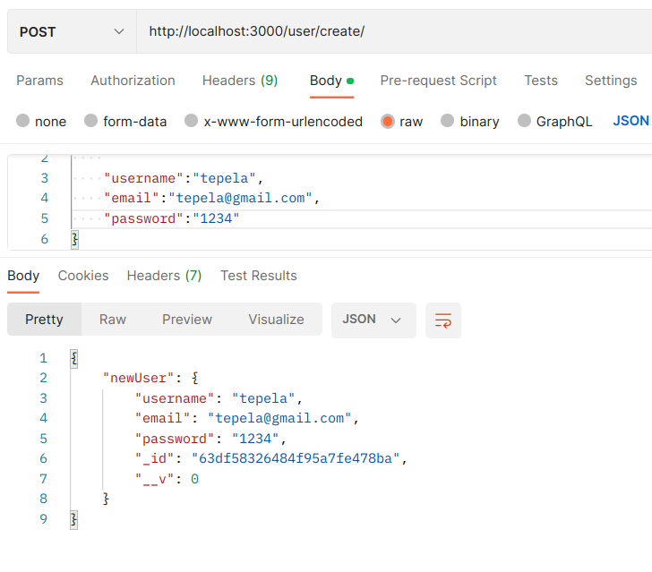
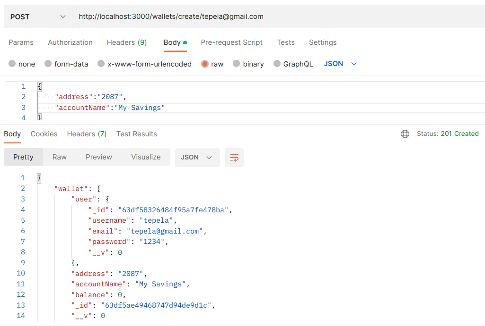
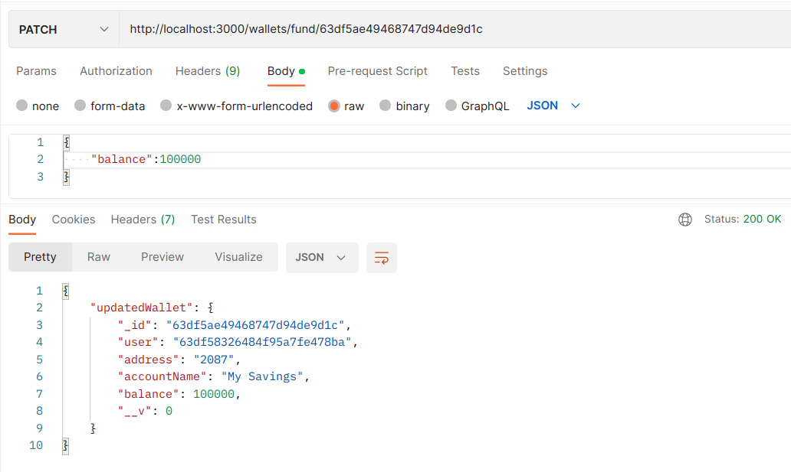
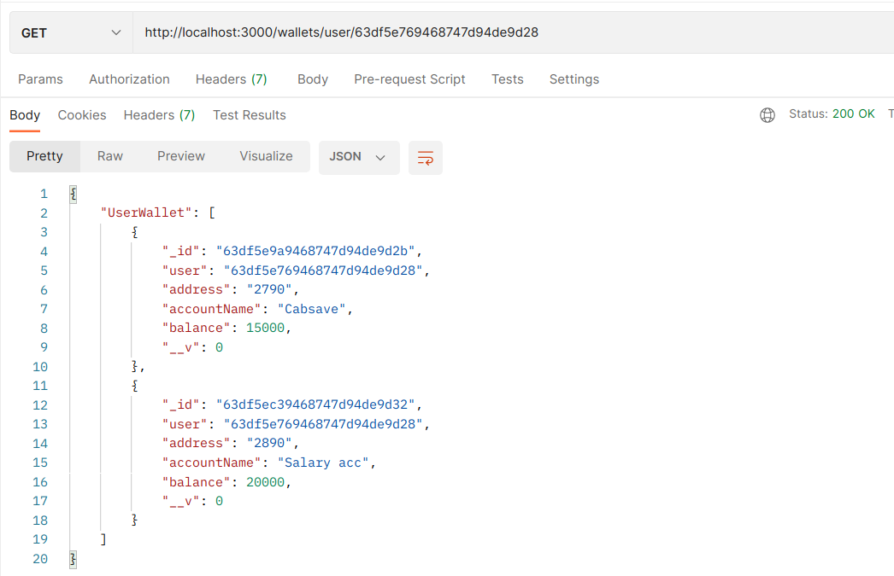
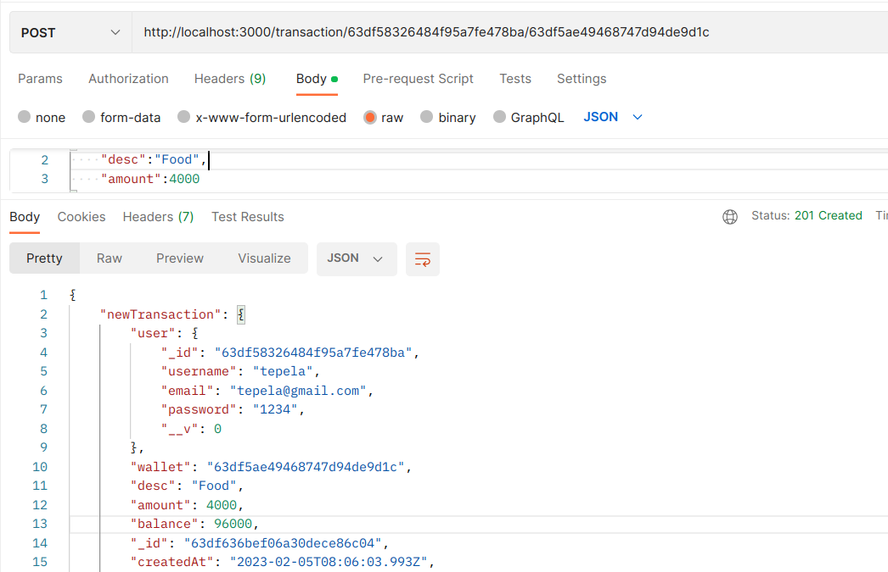

# :star2: :star2: :star2: Backend Test for Touch inspiration :star2: :star2: :star2: :star2:

#### `User Flow`
1. A user signs up (no sign in required. Disregard authentication).
2. A user can create wallets.
3. A user can add expenses or incomes to a wallet.
4. A user can view their profile with the summary of wallets and balances. Show overall balance of all wallets and balance of each wallet.
5. A user can drill into each wallet to see balance and transactions.`

## Code solution :sparkles:

### Before you run this project please make sure you add your `mongoose string` on your `app.module.ts` file!.

### 1. A user signs up using `email,password,username`.

### 2. A user can create a wallets in which the `balance` will be `0` by default.

### 3. A user is able to add income to that account using `wallet-ID` which it updates the `balance` in the wallet.

### 4. A user is able to view his or her own wallets 

### 5. A user is able to add expense or make a transaction using `userID` and `walletID`

### 6. Drilling into a wallet to check balance and Transaction Done on that wallet using `walletID`.

